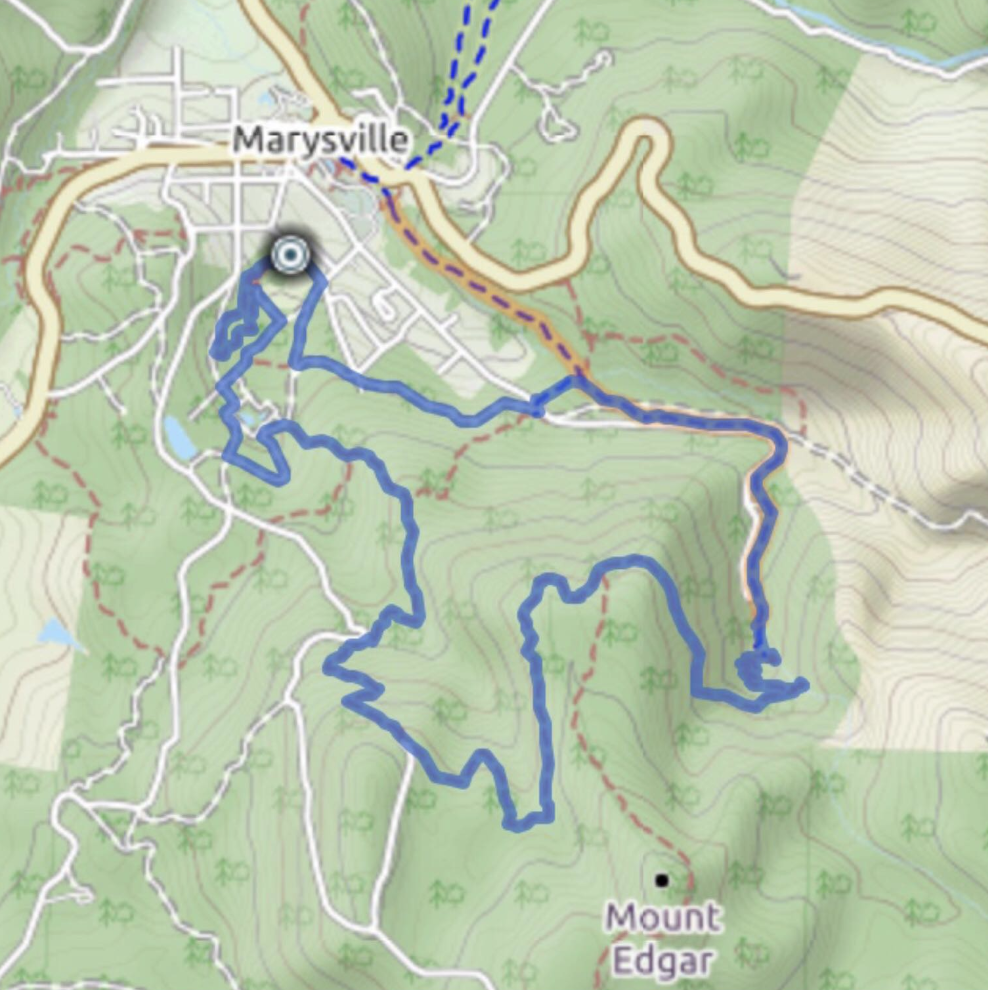
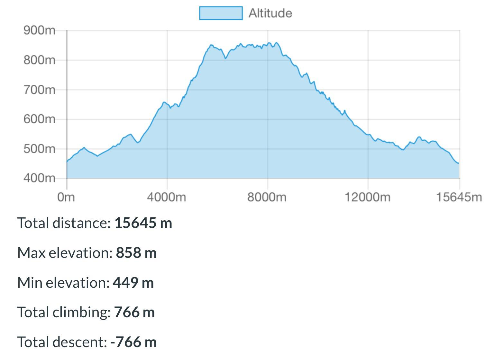
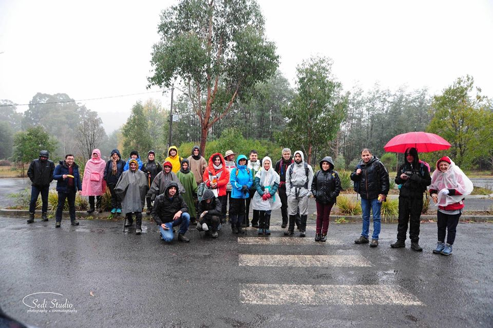

# Keppell Lookout and Steavenson Falls

## 1. Details

| Total Distance | 15.5 km |
| --- | --- | --- | --- | --- | --- |
| Duration | 5-6 hours |
| Grade | 3+ |
| Type of Trail | Loop |
| Beginning | 26 Kings Rd Marysville |
| End | 26 Kings Rd Marysville |

## 2. Events

| Leader | Page | Date |
| --- | --- |
| [Raden Zahiri](https://www.facebook.com/profile.php?id=100009105229001) | [Link](https://www.facebook.com/events/1886455234745969) | 30 June 2018 |

## 3. Map

## 4. Altitude

## 5. Summary

Keppell Lookout and Steavenson Falls commences at Kings Road Carpark, Marysville and climbs up through stringybark and mountain ash forest to four of Marysville’s best lookouts for spectacular views across Marysville, the Cathedral Range State Park and Steavenson Falls. You will then make your way back via the Upper and Lower Steavenson Falls Lookouts.  
  
The most challenging trail in the area, the Keppel Lookout trail is fairly uneven and steep in places.  
  
Getting there  
As you near Marysville via Marysville road, turn right into Old Melbourne Road and then into Kings Road \(right into Kings road if coming from Melbourne\). Cross over Pack Road and the car park is about 150 metres on your right.

## 6. Photos

